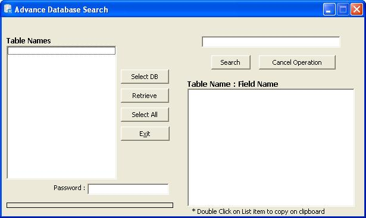



## Advance Search Database

### Description

Advance Search Database

It provides advance searching for MS Access databases.

No need to provide Table names; it will retrieve tables from the given database and list it out.

Just select table names from the list and put the record to search.

It will return you the fields and table names where the record present.

Its so simple to use

Basically it is use to seach the whole database. Many of the times you gets confused in which table the record present or while analyzing software you entered a record and want to find where actually it get stored into the backend.

Just try it and then rate me.
 
### More Info
 

             |
---                |---
**Submitted On**   |2009-12-03 05:10:02
**By**             |[Ashish Kumbhar](https://github.com/Planet-Source-Code/PSCIndex/blob/master/ByAuthor/ashish-kumbhar.md)
**Level**          |Intermediate
**User Rating**    |4.8 (24 globes from 5 users)
**Compatibility**  |VB 6\.0
**Category**       |[Databases/ Data Access/ DAO/ ADO](https://github.com/Planet-Source-Code/PSCIndex/blob/master/ByCategory/databases-data-access-dao-ado__1-6.md)
**World**          |[Visual Basic](https://github.com/Planet-Source-Code/PSCIndex/blob/master/ByWorld/visual-basic.md)
**Archive File**   |[Advance\_Se2169211232009\.zip](https://github.com/Planet-Source-Code/ashish-kumbhar-advance-search-database__1-72698/archive/master.zip)

